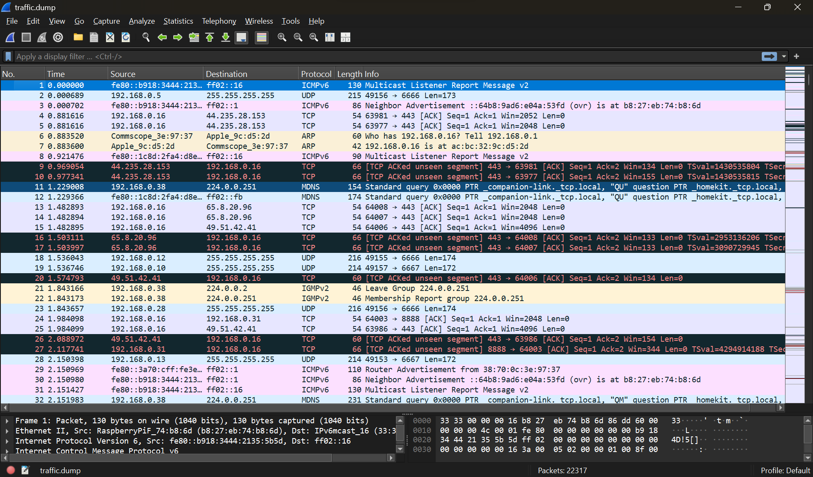

# Assignment 1: Network Forensics & Packet Analysis

Category: Network Security | Digital Forensics  
Status: ✅ Completed  
Date: October 2025

---

## Challenge Overview

Investigated security incident involving network sniffers. Analyzed 22MB packet capture to identify compromised credentials and security vulnerabilities in cleartext protocols.

Goal: Extract sensitive data from captured network traffic

---

## Vulnerabilities Discovered

- Cleartext protocols (HTTP, IMAP, POP3) exposing credentials
- WiFi passwords visible in network traffic
- Unencrypted authentication data
- Sensitive media files transmitted insecurely

---

## Tools Used

- Wireshark - Packet analysis, display filters, TCP stream following
- Nmap - Network reconnaissance and service enumeration  
- grep - Pattern matching for credential extraction

---

## Analysis Process

1. Network reconnaissance with Nmap
2. Packet analysis using Wireshark Protocol Hierarchy
3. MAC address correlation via ARP traffic
4. DNS server identification
5. HTTP stream analysis for credentials
6. Media file extraction using Export Objects
7. Command-line validation with grep

---

## Key Learnings

- Cleartext protocols expose all transmitted data to sniffers
- Display filters essential for large packet captures
- Multi-tool approach (GUI + CLI) provides thorough analysis
- Passive monitoring requires no active exploitation

---

## Defensive Measures

- Enforce TLS/SSL for all protocols
- Deploy network IDS/IPS
- Implement multi-factor authentication
- Monitor for cleartext credential transmission
- Regular packet capture audits

---

## Results

Questions Solved: 8/8  
Time: ~6 hours  
Protocols: HTTP, HTTPS, SSH, DNS, ARP

---

[Back to Course Overview](../README.md)