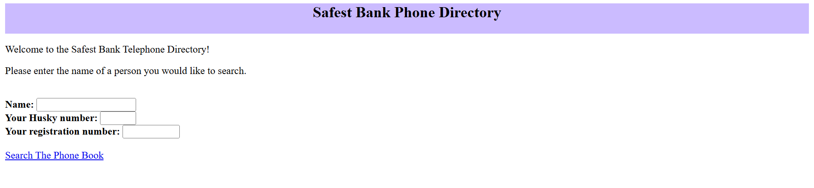

# Assignment 4: Command Parameter Injection

**Category:** Web Application Security  
**Status:** Completed  
**Date:** October 2025

---

## Challenge Overview

Exploited command parameter injection vulnerability in Safest Bank's online telephone directory application. Manipulated command-line parameters to execute arbitrary system commands and extract sensitive files from the web server.

**Target:** Safest Bank phone directory web application  
**Goal:** Extract sensitive system files and information

---

## Vulnerabilities Exploited

- Command injection through grep utility parameters
- Insufficient input sanitization and filtering
- Client-side validation bypass
- Improper access control on system files

---

## Tools Used

- Browser Developer Tools
- Command injection payloads
- Unix/Linux command chaining
- File system traversal

---

## Attack Process

1. Analyzed HTML source code
2. Tested for command injection points
3. Bypassed client-side filtering
4. Crafted command separator payloads
5. Executed arbitrary system commands
6. Located and extracted sensitive files

---

## Key Learnings

- Command injection happens when user input reaches system calls
- Client-side validation provides zero security
- Shell metacharacters enable command chaining
- Never invoke system commands from web apps

---

## Defensive Measures

- Avoid system calls entirely in web applications
- Use language-specific functions instead
- Implement strict server-side validation
- Apply whitelist filtering
- Run web apps with minimal privileges

---

## Results

**Questions Answered:** 6/6  
**Time:** 5 hours

---

[Back to Course Overview](../README.md)